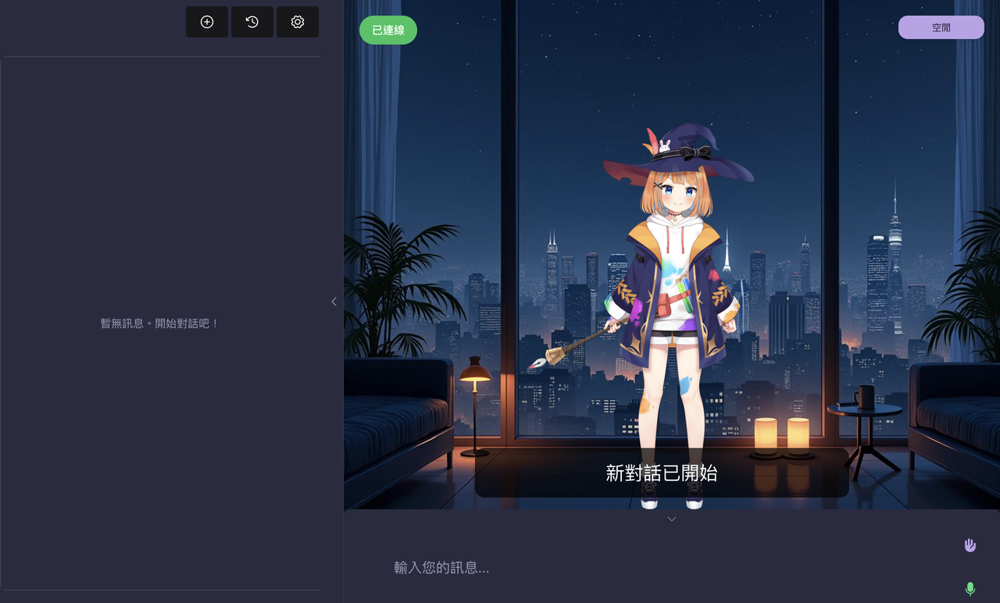
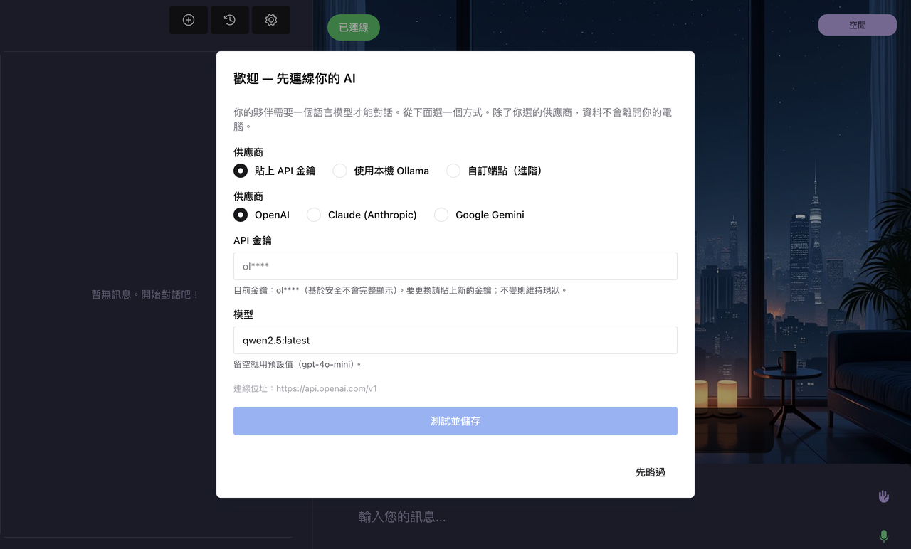

# Tomoshibi

> Live2D 아바타를 가진 무료 오픈소스 입문자 친화 **데스크톱 AI 컴패니언** — 장기 기억, 능동적 대화, 자연스러운 음성, 그리고 수면 모드까지. LLM만 직접 준비하면, 나머지는 설치하자마자 바로 작동합니다.

**언어:** [English](./README.md) | [繁體中文](./README.md#繁體中文) | [日本語](./README.JP.md) | **한국어** | [简体中文](./README.CN.md)


---

> ### 현재 상태
>
> **Tomoshibi**는 **[Open-LLM-VTuber](https://github.com/Open-LLM-VTuber/Open-LLM-VTuber)** 위에 만들어졌습니다.
> 데스크톱/웹 UI는 상류의 Open-LLM-VTuber-Web을 기반으로 다시 만들었습니다.
>
> 모든 설정은 앱 안에서 끝납니다——첫 실행 LLM 마법사, 캐릭터 관리, 음성, 기억,
> 능동적 화제, 번역, 원격 접속. `conf.yaml`을 직접 편집할 필요가 없습니다.
>
> **아직 패키징된 릴리스가 없습니다.** 소스에서 실행하거나(아래 "**터미널이 더
> 편하신가요? (고급)**" 참고), 직접 패키징하세요.

## 이게 뭔가요?

**Tomoshibi**는 화면 위의 Live2D 캐릭터를, 진짜로 대화하게 되는 AI 컴패니언으로 만들어 줍니다 — 당신을 기억하고, 스스로 먼저 말을 걸고, 당신이 말하는 동안 귀 기울여 듣고, 당신이 잘 자라고 인사하면 조용해집니다.

이건 훌륭한 [Open-LLM-VTuber](https://github.com/Open-LLM-VTuber/Open-LLM-VTuber) 프로젝트를 **친절하게 다시 포장한** 버전입니다. 우리는 그 어깨 위에 서 있습니다: 상류(upstream) 프로젝트가 탄탄한 Live2D + ASR/TTS + LLM 기반을 제공하고, 이 fork는 그것을 비개발자도 쓸 수 있는 **다운로드 → 더블클릭 → 대화** 경험으로 감싸면서, 기억 시스템, 능동적 대화, 자연스러운 끼어들기(barge-in) 음성, 캐릭터 관리, 앱 내 설정 마법사, 그리고 완전한 이중 언어(English / 繁體中文) UI를 더했습니다.

**우리의 원칙 — 그리고 우리가 의도적으로 하지 않는 것:**

- **무료 오픈소스, 기부는 선택.** 유료 등급도, 페이월(paywall)도 없습니다.
- **모바일 버전 없음.** 데스크톱 전용입니다 (macOS / Windows).
- **모델 마켓플레이스 / 저작권 있는 캐릭터 번들 없음.** 이렇게 해서 Live2D 상업 라이선스의 함정을 피합니다 — 우리는 중립적인 무료 기본값만 제공하고, 캐릭터·음성·LLM은 당신이 직접 가져옵니다.

> Open-LLM-VTuber 위에 만들어졌습니다. 전체 출처 표기와 구성 요소별 라이선스는 [`NOTICE`](./NOTICE)를, 원본 프로젝트 문서는 [`README.upstream.md`](./README.upstream.md)를 참고하세요.

---

## 기능

- **장기 기억** — 당신이 누구인지, 무엇을 하고 있는지 기억하고, 시간이 지날수록 당신을 더 알아 갑니다. 캐릭터별로 정리된 "핵심 기억"이 페르소나에 주입되며, 매 대화 차례마다 LLM이 무엇을 저장할 가치가 있는지 판단합니다. 변경 사항은 즉시 적용됩니다(재시작 불필요). 기억 용량 상한은 조절 가능합니다.
- **능동적 화제** — 한동안 조용하면 스스로 화제를 꺼냅니다. 선택적으로 최신 AI / 기술 / 애니메이션 / 게임 뉴스를 가져와 대화 소재로 삼을 수 있습니다(순수 표준 라이브러리 헬퍼, **API 키 불필요**).
- **자연스러운 끼어들기 음성 대화** — 언제든 말할 수 있습니다. 마이크를 기다릴 필요가 없고, 실제 대화처럼 말하는 도중에 끊을 수도 있습니다.
- **수면 / 방해 금지 모드** — "晚安"(잘 자)이라고 말하면 먼저 말 거는 것을 멈춥니다. 다음에 당신이 다시 말을 걸면 재개됩니다. 키워드는 설정으로 바꿀 수 있습니다.
- **캐릭터 관리** — 캐릭터를 생성 / 편집 / 전환 / 삭제할 수 있습니다: 이름 + 페르소나 + Live2D 스킨 + 음성 + 각자 분리된 기억.
- **첫 실행 설정 마법사** — API 키(OpenAI / Claude / Gemini)를 붙여넣거나 로컬 Ollama 모델을 고릅니다. 마법사는 저장하기 전에 빠른 테스트 호출을 한 번 실행합니다.
- **LLM 설정 탭** — API 키를 붙여넣거나, Ollama 모델을 고르거나 직접 입력합니다(로컬 모델, 또는 Ollama를 통해 제공되는 클라우드 모델).
- **성능 프리셋** — 경량 / 표준 / 고성능, ASR/TTS 엔진 선택 + 기억 정리 빈도 + 모델 keep-alive를 한 번에 묶어 둡니다.
- **다국어 번역** — 선택적인 자막 / 음성 번역(기본값 꺼짐).
- **설치하자마자 작동** — 샘플 Live2D 모델 + 무료 클라우드 TTS(edge-tts) + 자동으로 내려받는 음성 인식(ASR) 모델(약 1GB이며, 맨 처음 실행할 때 한 번만 내려받고 몇 분 걸립니다)을 기본 제공합니다. 당신은 LLM만 연결하면 됩니다.
- **완전한 이중 언어 UI** — 번체 중국어(zh)와 영어(en).

---

## 스크린샷



*데스크톱에서 실행 중인 Tomoshibi: 진짜로 대화하게 되는 Live2D 아바타.*

---

## 빠른 시작 (다운로드 → 더블클릭 → 대화)

가장 쉬운 길 — **터미널이 필요 없습니다.**

> **시작하기 전에: AI "두뇌"(LLM)가 필요합니다.**
> Tomoshibi는 **몸과 얼굴**입니다 — 아바타, 음성, 기억. 실제로 생각하고 말하는 **두뇌**는 *당신*이 직접 준비하는 별도의 AI입니다. 첫 실행 마법사에서 설정합니다. 쉬운 순서대로 선택지는 다음과 같습니다:
> - **(추천 — 무료, 비공개, 당신의 컴퓨터에서 실행) Ollama를 통한 로컬 모델.** 무료 앱 **[Ollama](https://ollama.com)**를 설치한 뒤, 터미널에서 `ollama pull qwen2.5:3b`를 실행하세요(약 1.9 GB의 작은 모델). Tomoshibi의 기본값이 이미 이것을 가리키고 있어 바로 작동합니다 — **계정 불필요, API 키 불필요, 비용 없음, 오프라인 작동, 그리고 당신의 대화는 절대 컴퓨터를 벗어나지 않습니다.** 보통의 8~16 GB 노트북에서도 잘 돌아갑니다. (더 똑똑한 답변을 원하고 RAM이 넉넉한가요? `qwen2.5:7b` 같은 더 큰 모델을 pull하고 설정에서 고르세요.)
> - **(선택 — PC가 약하면 품질이 더 좋음) Ollama Cloud 무료 등급.** Ollama는 *자사* 서버에서 더 큰 모델을 무료로 돌릴 수 있습니다(한도 있음). 무료 계정이 필요합니다 — 아래 **옵션 B** 참고. 먼저 그 클라우드 모델을 `ollama pull` 해야 합니다.
> - **(선택 — 무료 중 최고 품질) 무료 호스팅 API 키.** Google AI Studio(Gemini), Cerebras, 또는 Groq가 무료 키를 줍니다(신용카드 불필요). 무료 선택지 중 품질이 가장 좋지만, 계정 + 키가 필요하고 당신의 대화가 해당 제공업체로 전송됩니다. **옵션 C** 참고.
> - **(이미 유료로 쓰고 있다면) 클라우드 API 키**: OpenAI / Claude / Gemini의 것 — 최고 품질, 대화 한 번에 몇 원 수준. **옵션 D** 참고.

1. **코드 받기.** 저장소 페이지에서 초록색 **`<> Code`** 버튼 → **Download ZIP**을 선택한 뒤 압축을 풉니다(예: 바탕화면). _(git이 편하다면 `git clone`도 좋습니다.)_
2. 압축을 푼 폴더 안에서 **런처를 더블클릭**합니다:
   - **macOS:** `start-companion.command`
   - **Windows:** `start-companion.bat`
   - 첫 실행 때 모든 것을 설치하며(`uv` 다음에 의존성), 몇 분 걸릴 수 있습니다. **그 창은 닫지 마세요 — 그게 바로 서버입니다.**
3. 브라우저가 **http://localhost:12393**으로 열립니다. 첫 실행 시 **설정 마법사**가 나타납니다: **API 키 붙여넣기**(OpenAI / Claude / Gemini) **또는** **로컬 Ollama 모델 선택** 중 하나를 합니다. 마법사는 저장하기 전에 당신의 선택을 테스트합니다.

   

   *첫 실행 설정 마법사, 여기서 당신의 AI "두뇌"를 연결합니다.*

4. **새 두뇌가 작동하도록 재시작하세요.** 2단계의 **바로 그 런처/터미널 창을 닫아** 종료하면(서버가 멈춥니다), **다시 런처를 더블클릭**해서 새 LLM과 함께 다시 시작합니다. (앱도 LLM 변경은 "재시작 후 — 또는 캐릭터를 한 번 전환한 후 적용됩니다"라고 안내합니다.) 그런 다음 대화를 시작하세요. 오디오를 켜려면 페이지를 한 번 클릭합니다.

> **macOS Gatekeeper (첫 실행에만):** 더블클릭하면 *"확인되지 않은 개발자가 배포했기 때문에 열 수 없습니다"*라고 나올 수 있습니다. 서명되지 않은 오픈소스 앱에서는 정상입니다. `start-companion.command`를 **마우스 오른쪽 클릭** → **열기** → 대화상자에서 **열기**를 누르세요. 한 번 허용하고 나면 그 다음부터는 더블클릭으로 됩니다. (우리는 서명/공증된 빌드를 제공하지 않습니다 — 무료 등급이니까요.)

> **Windows SmartScreen (첫 실행에만):** 더블클릭하면 파란색 **"Windows의 PC 보호"** 상자가 나올 수 있습니다. 서명되지 않은 오픈소스 앱에서는 정상입니다. **추가 정보** → **실행**을 누르세요. 한 번 허용하면 다시 묻지 않습니다.

설치하자마자 기본으로 제공되는 **mao** 샘플 Live2D 모델과 **edge-tts**(무료 클라우드 음성, GPU 불필요)를 사용합니다. 첫 실행 때 음성-텍스트 변환(STT) 모델도 자동으로 내려받는데 —— 이 모델은 약 **1GB**라서, **맨 처음 실행에서는 한 번만 일어나는 다운로드 + 압축 해제에 몇 분이 걸릴 수 있습니다**. 이 동안 런처 창이 멈춘 것처럼 보일 수 있지만 멈춘 게 아닙니다. **닫지 말고 끝날 때까지 기다리세요.** 이건 처음 한 번만 일어납니다.

### 터미널이 더 편하신가요? (고급)

대부분의 사람은 위의 **Download ZIP** 경로를 쓰면 됩니다. 터미널이 익숙하다면 대신 repo를 clone할 수 있습니다. **Python ≥ 3.10, < 3.13**과 [`uv`](https://github.com/astral-sh/uv)가 필요합니다.

```bash
git clone https://github.com/weryk153/tomoshibi.git && cd tomoshibi
uv sync                  # installs dependencies
uv run run_server.py     # start the server
# open http://localhost:12393  → setup wizard → chat
```

마법사가 당신의 LLM 선택을 `conf.yaml`에 대신 기록해 줍니다. 물론 직접 손으로 편집할 수도 있습니다(아래 참고).

---

## 시작 / 종료 / 부팅 시 자동 시작

**시작하기 (「호스트」 열기):**

- **Windows:** **`start-companion.bat`** 더블클릭
- **macOS:** **`start-companion.command`** 더블클릭 —— 처음에는 macOS가 막을 수 있으니, 파일을 우클릭 → **열기** → 다시 **열기**. 이후로는 평범한 더블클릭으로 됩니다.

검은 명령 창이 열립니다 —— **그 창이 곧 서버입니다. 대화하는 동안 계속 열어 두세요.** 준비되면 브라우저로 앱(`http://localhost:12393`)을 알아서 엽니다. 이렇게 생각하면 됩니다: **명령 창은 엔진, 브라우저 탭은 화면일 뿐.**

> 첫 실행에만: 약 1GB의 음성 모델을 내려받느라 몇 분 걸립니다. 창이 멈춘 것처럼 보여도 정상이니 —— 열어 둔 채 끝날 때까지 기다리세요.

**종료하기:**

- **검은 명령 창을 닫으면**(또는 창 안에서 **Ctrl + C**) 완전히 멈춥니다.
- **브라우저 탭**만 닫으면 화면만 가려질 뿐 서버는 계속 돕니다. 실제로 멈추려면 명령 창을 닫으세요.
- 로컬 두뇌용으로 **Ollama**를 설치했다면 백그라운드에서 계속 실행됩니다. 유휴 시 가벼우니 그냥 둬도 되고, 끄려면 작업 표시줄(Windows)/메뉴 막대(macOS) 아이콘에서 Quit 하세요.

**나중에 다시 열려면:** 같은 런처를 다시 실행하면 됩니다(이게 평소 실행 방법입니다).

**컴퓨터를 켤 때 자동으로 시작하기 (선택):**

- **Windows**
  1. **`start-companion.bat`** 우클릭 → **바로 가기 만들기**.
  2. **Win + R**를 누르고 **`shell:startup`** 입력 후 **Enter** —— 시작프로그램 폴더가 열립니다.
  3. 바로 가기를 그 폴더에 넣으세요. 이제 로그인할 때마다 자동 시작됩니다. *(취소: 그 폴더에서 바로 가기를 삭제.)*

- **macOS**
  1. **시스템 설정 → 일반 → 로그인 항목 및 확장 프로그램** 열기.
  2. **로그인 시 열기** 아래에서 **+**를 클릭하고 **`start-companion.command`** 선택(또는 파일을 목록으로 드래그).
  *(취소: 선택 후 **−** 클릭.)*

두 방법 모두 로그인 시 명령 창(이어서 브라우저)이 알아서 뜹니다. 참고: 부팅할 때마다 터미널 창이 뜨는 것은 정상입니다(엔진이 시작되는 것). 로컬 Ollama 두뇌를 쓰면 Ollama는 설치 후 자동 시작되므로 전체가 저절로 켜집니다.

---

## LLM 설정 (필수)

클라우드 LLM용 API 키 **또는** 실행 중인 로컬 LLM, **둘 중 하나**가 필요합니다. 컴패니언 대화에는 저렴한 모델로도 충분하며, 최상급 모델이 필요하지 않습니다.

#### 옵션 A — 로컬 Ollama (추천: 무료, 비공개, 계정 불필요)
[Ollama](https://ollama.com/download)를 설치한 뒤, 터미널에서 `ollama pull qwen2.5:3b`를 실행합니다(약 1.9 GB). Tomoshibi의 기본값이 이미 `qwen2.5:3b`를 쓰므로, 다운로드가 끝나면 다음 재시작 후 바로 작동합니다 — API 키 없음, 계정 없음, 클라우드 비용 없음, 완전 오프라인, 그리고 당신의 대화는 컴퓨터에 머뭅니다. 보통의 8~16 GB 노트북에서 편안하게 돌아갑니다. 더 똑똑한 답변을 원하면, 더 큰 모델(예: `qwen2.5:7b`)을 pull한 뒤 LLM 설정 탭에서 설정하세요.

#### 옵션 B — Ollama를 통한 클라우드 모델 (무료 계정; PC가 약하면 좋음)
Ollama는 자사 서버에서 *더 큰* 모델을 돌릴 수 있어, 느린 컴퓨터에서도 좋은 답변을 받습니다. 무료 등급이지만 계정이 필요하고, 먼저 모델을 pull해야 합니다:
1. [ollama.com/download](https://ollama.com/download)에서 Ollama를 설치합니다(v0.12+).
2. [ollama.com](https://ollama.com)에서 무료 계정을 만든 뒤, 터미널에서 `ollama signin`을 실행합니다.
3. **`ollama pull gpt-oss:20b-cloud`를 실행하세요 — 작동하려면 먼저 pull해야 합니다.** (설정에서 이름만 입력하는 것으로는 충분하지 않습니다.)
4. LLM 설정 탭에서 Ollama를 선택하고, 모델을 `gpt-oss:20b-cloud`로 설정합니다.

`gpt-oss:20b-cloud`는 무료 등급에 가장 적합한 가벼운 모델입니다. `qwen3.5:cloud`나 `minimax-m3:cloud`는 더 강력하지만 무료 한도를 더 빨리 소진합니다.

> **"무료"에 대해 솔직히:** 신용카드 없이 $0, 무료 계정만 있으면 됩니다 — 다만 *가벼운 사용*용 등급입니다: 한 번에 클라우드 모델 하나, 세션 한도는 약 5시간마다 초기화되고 주간 한도도 있으며, Ollama가 정확한 수치를 공개하지 않으므로 많이 대화하면 초기화될 때까지 한도에 도달할 수 있습니다. 추론은 **Ollama의 서버**에서 돌아가므로, 완전히 비공개로 두고 싶은 내용은 보내지 마세요. 클라우드 모델은 프리뷰(preview) 단계입니다 — **의존하기 전에, 한 번 제대로 답하는지 확인하세요.**

#### 옵션 C — 무료 호스팅 API 키 (Gemini / Cerebras / Groq)
무료 선택지 중 채팅 품질이 가장 좋습니다. 무료 계정을 만들고(신용카드 불필요), API 키를 생성한 뒤, LLM 설정 탭에서 해당하는 base URL과 함께 붙여넣습니다:
- **Google AI Studio(Gemini):** `https://generativelanguage.googleapis.com/v1beta/openai/` — 무료 등급이 넉넉함. 단, Google이 무료 등급 대화를 제품 개선에 사용할 수 있다는 점에 유의하세요.
- **Cerebras:** `https://api.cerebras.ai/v1` — 매우 빠름, 하루 약 100만 토큰 무료(무료 등급은 context window가 짧음).
- **Groq:** `https://api.groq.com/openai/v1` — 매우 빠름, 하루 토큰 상한 있음.

각 제공업체 문서에 있는 최신 모델 이름을 사용하세요. 당신의 대화는 해당 제공업체로 전송되며, 무료 등급에는 속도 제한이 있습니다.

#### 옵션 D — 유료 클라우드 API 키 (OpenAI / Claude / Gemini)
이미 유료로 쓰고 있다면, 마법사에 키를 붙여넣기만 하면 됩니다. 품질이 가장 높고, 작은 모델은 보통 대화 한 번에 몇 원 수준입니다.

### ⚠️ 추론("thinking") 모델은 추론을 꺼야 사용할 수 있습니다

**`glm-4.7:cloud`** 같은 추론 모델은 답변을 별도의 `reasoning` 필드에 넣고, 일반 `content` 필드는 **비워 둡니다**. 이 앱은 `content`만 읽기 때문에, 추론 모델은 **빈 응답**으로 나타납니다 — 그리고 읽어 줄 내용이 없으니 **음성도 나오지 않습니다**.

**권장:** 일반(비추론) 대화 모델을 고르세요. 작고 빠른 모델이 어차피 더 자연스럽고 지연이 적은 컴패니언을 만들어 줍니다.

**그래도 쓰고 싶다면:** 대부분의 엔드포인트에서 추론을 끌 수 있고, 끄면 일반 대화 모델처럼 동작합니다. `conf.yaml`의 LLM 블록에 `extra_body`를 추가하세요:

```yaml
extra_body:
  reasoning_effort: 'none'
```

파라미터 이름은 제공자마다 다르므로 엔드포인트 문서를 확인하세요. LM Studio에서 `qwen3.5`로 실측한 결과 `reasoning_effort`만 동작했고, `chat_template_kwargs.enable_thinking`, 프롬프트 앞의 `/no_think`, `reasoning.enabled`는 모두 조용히 무시되었습니다. 추론을 끄면 큰 지연도 사라집니다: 켜 둔 상태에서는 한 문장을 말하기까지 수천 자를 추론에 썼습니다.

> 수동 편집: LLM 설정은 `conf.yaml`의 `character_config → agent_config → llm_configs → openai_compatible_llm` 아래에 있습니다. 파일 안의 주석이 자신의 키로 OpenAI / Claude / Gemini를 가리키는 방법을 보여 줍니다. 편집 후에는 런처를 재시작하세요.

---

## 기타 설정

### 기억 (핵심 + 심층 회상)
기본으로 켜져 있습니다. 각 캐릭터는 `chat_history/<conf_uid>/core_memory.md`에 자신의 기억을 보관합니다 — 페르소나에 주입되는 핵심 기억에 더해, 매 대화 차례마다 LLM이 정리합니다(무엇을 남길지는 모델이 판단).

### 캐릭터
앱 안에서 캐릭터를 생성 / 편집 / 전환 / 삭제합니다 — 각자 고유한 이름, 페르소나, Live2D 스킨, 음성, 그리고 **분리된 기억**을 가집니다. 자신의 Live2D 모델을 추가하려면 `live2d-models/<name>/` 아래에 넣고, `model_dict.json`에 항목을 추가한 뒤 선택하면 됩니다. **저작권 있는 캐릭터 모델을 공개 repo에 commit하지 마세요.**

#### 더 많은 캐릭터 (선택)
라이선스 안전을 위해, Tomoshibi는 **무료 Live2D 오리지널 캐릭터 3개**(`mao_pro`, `haru`, `hiyori`)만 기본 제공합니다. 더 많이 원하시나요 — 남성 집사 캐릭터 **Natori**까지 포함해서? 무료 공식 Live2D 샘플 모델을 직접 공식 페이지에서 받아 넣을 수 있습니다. **[Live2D 샘플 모델 페이지](https://www.live2d.com/en/learn/sample/)**에서 Live2D 자체 라이선스에 따라 받으세요 — 우리는 그것들을 재배포하지 않습니다. 방법은 [`docs/add-live2d-character.md`](docs/add-live2d-character.md)를 참고하세요.

### 성능 프리셋
**경량 / 표준 / 고성능** 프리셋은 ASR/TTS 엔진 선택, 기억 정리 빈도, 모델 keep-alive를 한 번에 묶어 둡니다. 사양이 낮은 컴퓨터에서는 경량을, 하드웨어가 충분하면 고성능을 고르세요.

### 능동적 화제 & 뉴스
컴패니언은 일정 시간 동안 조용하면 화제를 꺼냅니다. 선택적으로, 번들된 뉴스 헬퍼(`scripts/news_topics.py`)로 최신 헤드라인을 가져와 그 화제를 갱신할 수 있고 — 순수 표준 라이브러리, API 키 불필요 — 이를 일정에 맞춰(cron / launchd / Task Scheduler) 예를 들어 몇 시간마다 실행할 수 있습니다.

### 수면 / 조용 모드
"晚安"이라고 말하면 먼저 말 거는 것을 멈춥니다. 다음 메시지에서 재개됩니다. 키워드는 설정으로 바꿀 수 있습니다.

### 번역
선택적인 다국어 자막/음성 번역, **기본값은 꺼짐**입니다(`conf.yaml`의 `tts_preprocessor_config → translator_config`).

### 음성
기본값은 **edge-tts**(무료, 하드웨어 불필요)입니다. 고품질의 로컬/맞춤 음성을 원하면 [GPT-SoVITS](https://github.com/RVC-Boss/GPT-SoVITS)를 서비스로 실행하고 설정이 그것을 가리키게 하세요(GPU 또는 Apple Silicon 필요). 실제 사람의 목소리를 음성 복제(voice-cloning)하는 것에 대한 법적 책임은 당신에게 있습니다.

---

## 문제 해결

**앱이 열리지 않거나 검은 창이 바로 닫힙니다.**
보통 예전 빌드가 복구하지 못하는 설정·엔진 선택이 원인입니다. **최신 릴리스**를 받으세요(예전 설정이어도 열립니다). 업데이트하기 싫다면: 앱 폴더의 `conf.yaml`을 열어 `asr_model: 'faster_whisper'`를 `asr_model: 'sherpa_onnx_asr'`로 바꾸고 저장한 뒤 다시 실행하세요. (`conf.yaml.backup`은 복원하지 마세요 — 같은 잘못된 설정이 들어 있습니다.)

**글로는 답하는데 소리가 안 납니다.**
최신 릴리스로 업데이트하고(Windows에 필요한 오디오 도구가 포함됨), 런처를 다시 실행해 의존성을 갱신하세요. 음성(TTS) 엔진을 GPT-SoVITS로 바꿨다면 별도 서비스가 필요합니다 —— 설정 → 성능에서 **Edge TTS**로 되돌리면 무료 내장 음성을 쓸 수 있습니다.

**첫 실행에서 브라우저에 "사이트에 연결할 수 없음 / 연결이 거부됨"이 뜹니다.**
서버가 아직 시작 중입니다 —— 첫 실행은 약 1GB 음성 모델을 내려받느라 몇 분 걸립니다. 검은 창을 열어 두고, 실행 중이라는 메시지가 나오면 `http://localhost:12393`을 새로고침하세요. 최신 릴리스는 준비가 되면 브라우저를 자동으로 엽니다.

**Windows: "Windows의 PC 보호"(SmartScreen)가 뜨거나 아무 일도 안 일어나는 것 같습니다.**
**추가 정보 → 실행**을 누르세요 —— 이건 런처이지 바이러스가 아닙니다(서명이 없을 뿐). 백신이 일회성 `uv` 설치를 막았다면 앱을 허용하고 다시 실행하거나, <https://docs.astral.sh/uv/getting-started/installation/>에서 `uv`를 수동 설치한 뒤 재시도하세요.

**macOS: "확인되지 않은 개발자라 열 수 없음".**
`start-companion.command`를 우클릭 → **열기** → **열기**. 처음 한 번만 하면 됩니다.

**열리는데 답이 없거나 AI 두뇌가 설정되지 않았다고 나옵니다.**
아직 LLM 설정이 필요합니다. 설정 마법사(또는 설정 → 모델)를 열어 API 키(OpenAI / Claude / Gemini)를 붙여넣거나 로컬 Ollama 모델을 고르세요. 로컬은 **Ollama 앱이 설치되어 실행 중**이고 모델이 다운로드되어 있어야 합니다.

**Claude에서 웹 검색/도구가 작동하지 않습니다.**
설정 마법사는 Claude를 호환 엔드포인트로 연결해 도구가 전달되지 않으므로, 실험적 웹 검색/도구 토글이 Claude에서는 효과가 없을 수 있습니다. 도구를 쓰려면 GPT-4o나 Gemini 같은 도구 호출 지원 모델, 또는 성능 있는 로컬 모델을 쓰세요. (Claude로 일반 대화는 정상 동작합니다.)

---

## 가이드

- [휴대폰 / 태블릿에서 사용하기 (Tailscale)](docs/remote-access-tailscale.md) — 집 네트워크 밖에서도 다른 기기에서 컴패니언에 접속할 수 있습니다.
- [GPT-SoVITS로 맞춤 음성 만들기](docs/custom-voice-gpt-sovits.md) — 캐릭터에게 복제하거나 맞춤 제작한 음성을 입혀 보세요.
- [자신의 Live2D 캐릭터 추가하기](docs/add-live2d-character.md) — 모델을 넣고 그것으로 전환하세요.

## 크레딧 & 라이선스

이 프로젝트는 그것이 기반으로 삼은 상류(upstream) 작업 없이는 존재할 수 없었습니다. [Open-LLM-VTuber](https://github.com/Open-LLM-VTuber/Open-LLM-VTuber)에도 **star를 누르고 후원해** 주세요.

- **상류(Upstream):** [Open-LLM-VTuber](https://github.com/Open-LLM-VTuber/Open-LLM-VTuber) — 그 서버 측 코드는 MIT이며, Copyright (c) 2025 Yi-Ting Chiu입니다.
- **Tomoshibi가 직접 추가한 것**(장기 기억, 능동적 대화, 수면 모드, 그룹 대화, 무대 연출, 그리고 이 모두를 위한 앱 내 설정 화면, 5개 언어 UI) — MIT.
- **Tomoshibi 자체의 변경**(데스크톱/웹 클라이언트를 상류 Open-LLM-VTuber-Web에서 재구축, 리브랜딩, 5개 언어 UI) — MIT.
- **번들된 웹 프론트엔드** — `frontend/`에 있는 컴파일된 웹 번들은 Open-LLM-VTuber-Web 프론트엔드이며, **Open-LLM-VTuber License 1.0**(Apache-2.0 + 추가 조건) 하에 있습니다. 무료, 비상업적 사용 및 재배포는 허용됩니다. 상업적 리브랜딩, 유료 호스팅/SaaS, 또는 유료 제품에 임베드하는 경우에는 Open-LLM-VTuber 조직으로부터 별도의 상업 라이선스를 받아야 합니다. 이 fork는 무료이고 비상업적이므로 해당 라이선스가 허용하는 범위 안에 있습니다. [`NOTICE`](./NOTICE)를 참고하세요.
- **Live2D Cubism & 번들된 샘플 모델** — 번들된 **mao_pro** / **haru** / **hiyori** 모델은 Live2D Inc.의 샘플 데이터이며, **Live2D Free Material License** 하에 사용됩니다(자세한 내용은 [`LICENSE-Live2D.md`](./LICENSE-Live2D.md)). 필수 출처 표기:
  > This content uses sample data owned and copyrighted by Live2D Inc.

  이들은 무료 기본값으로 **수정 없이** 번들되어 있습니다. **유료/상업 빌드에서는 반드시** 자신의 CC0 / 라이선스를 받은 / 의뢰 제작한 모델로 **교체하세요.**
- **기타 구성 요소**(각 라이선스는 [`NOTICE`](./NOTICE) 참고): GPT-SoVITS (MIT, 선택적 TTS), sherpa-onnx (Apache-2.0, ASR 엔진 — SenseVoice 모델은 자체 라이선스가 있음; 또는 Whisper 사용), Silero VAD (MIT), edge-tts (Microsoft의 온라인 TTS 서비스 사용), DeepLX (비공식 DeepL 엔드포인트 — 프로덕션에는 공식 DeepL API 사용).

**저작권 있는 캐릭터, 아트워크, 음성, 또는 학습된 음성 모델을 배포하지 마세요.** 이 repo는 중립적인 기본값만 제공합니다. 나머지는 직접 가져오세요.

### License

이 fork 자체의 소스 코드는 **MIT License** 하에 공개되며, Open-LLM-VTuber의 MIT 라이선스 서버 코드(Copyright (c) 2025 Yi-Ting Chiu) 위에 올라가 있습니다. 다만 **프로젝트 전체가 단순히 MIT인 것은 아닙니다**: `frontend/`에 번들된 컴파일 웹 프론트엔드는 **Open-LLM-VTuber License 1.0**(Apache-2.0 + 추가 조건) 하에 있고, 번들된 Live2D 샘플 모델은 각자의 Live2D 조건을 따릅니다. 완전하고 정확한 내용은 [`LICENSE`](./LICENSE), [`NOTICE`](./NOTICE), 그리고 [`LICENSE-Live2D.md`](./LICENSE-Live2D.md)를 참고하세요.

---

## 이 프로젝트 후원하기

이건 무료 오픈소스 프로젝트입니다 — 페이월은 없습니다. 도움이 되었다면 후원은 감사하지만, 절대 필수는 아닙니다:

- **Ko-fi:** [ko-fi.com/leonhsueh](https://ko-fi.com/leonhsueh)
- **GitHub Sponsors:** 곧 공개

그리고 이 프로젝트가 기반으로 삼은 상류 프로젝트 — [Open-LLM-VTuber](https://github.com/Open-LLM-VTuber/Open-LLM-VTuber)도 후원해 주세요.

---

## 기여하기

Issue와 pull request를 환영합니다.

- 버그와 기능 아이디어는 **Issues**에 올려 주세요.
- 코드 변경은 명확한 설명과 함께 **Pull Request**를 열어 주세요.
- 저작권 있는 캐릭터, 아트워크, 음성, 또는 학습된 음성 모델은 **추가하지 말아 주세요** — repo가 중립적인 기본값만으로 배포 가능한 상태를 유지하도록 해 주세요.
